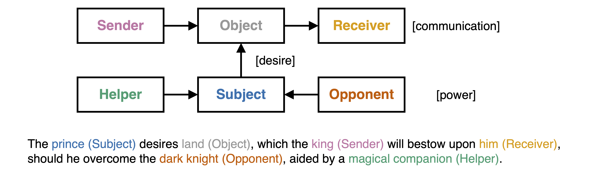

# Background

Greimas’ Actantial Model (1966/1984) characterises a narrative via six _actants_ grouped into three categories and fundamental relationships (Figure 1). The Subject and the Object, connected by the relationship of desire, constitute the model centre. The Object also serves as the object of communication between the Sender and the Receiver. Further, the Helper and the Opponent, the Circumstants, enact power upon the Subject and modulate its desire. Greimas based his model on the theoretical contributions by Vladimir Propp, Étienne Souriau, and Lucien Tesnière. Both Propp and Souriau developed similar sets of central roles for Russian folktales (Propp, 1928/1968) and the Drama (Souriau, 1950). Each role is defined via its function in the narrative. Propp initially introduced a set of 31 fundamental functions that serve as the foundational elements for narratives within the genre of the Russian folktale. In contrast, Greimas builds on the work of Tesniere (1959/2015), who first introduced the notion of actants as a syntactical category to establish a more general set of roles that could be applied across genres, thereby integrating the semantic content of various roles with the syntactic structure.

*Figure 1: Greimas' Actantial Model (1966/1984) as shown in Elfes et al. (2026). The arrows indicate the relationships of communication, desire, and power.*

A specific narrative is represented by its _semantic investment_, that is, the manifestation of each actant as a concrete actor or object in the narrative: a prince (Subject) desires land (Object), which the king (Sender) will bestow upon him (Receiver), should he overcome the dark knight (Opponent), aided by a magical companion (Helper).

The benefit of Greimas’ model is its universal character. Compared to Propp’s Villain, the Opponent is broader and less value-laden, allowing for nuance in its semantic investment. The Semiotic Square, a notion that supports the analysis of the relations between different semiotic signs (Greimas & Rastier, 1968), helps to reveal this nuance. Within this framework, the Opponent—the dark knight in the example above—relates to the Subject as its contrary. In contrast to the villain, who constitutes a contradiction, the contrary opposes the original Subject not in its entirety. Thus, both the Subject and the Opponent may share qualities and ambitions despite their different approaches. The actants thus form a complex substructure beyond the three fundamental relationships.

A single actor who personifies multiple actants constitutes an _actant syncretism_ and reveals additional nuance about the actor's role in the narrative. For instance, in the example provided, the prince is both the Subject and the Receiver. This dual role showcases the prince’s success in receiving his object of desire. This dynamic would change if we replaced the Receiver with the dark knight. The continuous reshaping of actantial roles through their semantic content is called their _thematic investment_.

Content in this chapter is taken from (Elfes & Bastos, forthcoming)

## References
Elfes, J. & Bastos, M. (forthcoming). A Structuralist Framework for Computational Narrative Analysis

Elfes, J., Bastos, M., & Aiello, L. M. (2026). On Narrative: The Rhetorical Mechanisms of Online Polarisation (arXiv:2601.07398). arXiv. https://doi.org/10.48550/arXiv.2601.07398

Greimas, A. J. (1984). Structural semantics: An attempt at a method (D. McDowell, R. Schleifer, & A. Velie, Trans.). University of Nebraska Press. (Original work published 1966)

Greimas, A. J., & Rastier, F. (1968). The Interaction of Semiotic Constraints. Yale French Studies, (41), 86–105.

Propp, V. (1968). Morphology of the Folktale (L. Scott, Trans.). University of Texas Press. (Original work published 1928)

Souriau, E. (1950). Les deux cent mille situations dramatiques. Flammarion.

Tesnière, L. (2015). Elements of structural syntax (T. J. Osborne & S. Kahane, Trans.). John Benjamins Publishing Company. (Original work published 1959)

